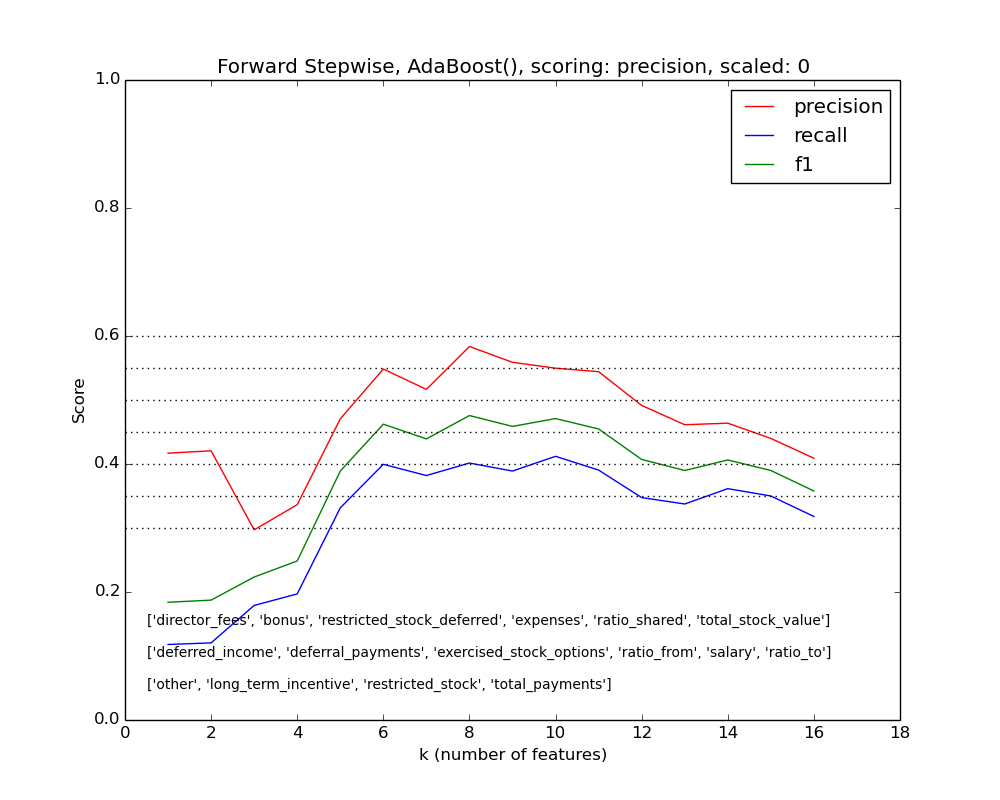
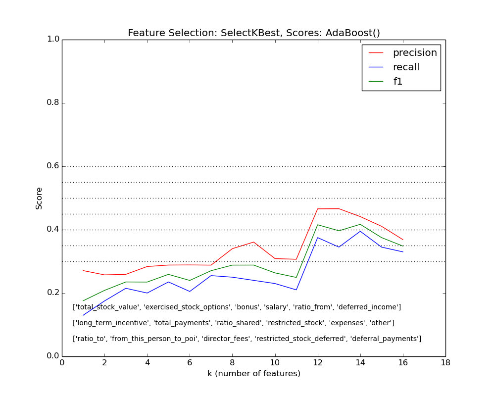

# Enron Scandal
##By César Tablas

***

## Introduction

Enron Corporation had a rocketing success to become one of US' giants in the energy sector. At it's peak Enron was well acclaimed and attracted many investors, customers and employees, and counted with great reviews from many industry and financial analysts. However, by the end of 2001 it was revealed that Enron's success was deceitful, and willfully so: starting from their own CEO down many high ranking employees and counting with their own auditing firm's complicity, Enron had been misrepresenting their real financial condition and commiting fraudulent actions that collectively led to the largest case of bankruptcy in the US at that time.

In this project I try to identify Enron employees who may have committed fraud by applying machine learning algorithms to the Enron financial and email data made public after the legal proceedings.

***

## The Dataset

The data file contains a pickled dictionary with 146 data points mapping the name of an Enron employee to a dictionary of 21 key:value pairs that contains financial and email information. Each employee is labeled as POI / not-POI ("Person Of Interest" in the fraud case) using the key "poi" with boolean values. After the initial exploration of the data I removed the entry "TOTAL" for not being a valid data point but an aggregation. I also removed the data point for the employee "LOCKHART EUGENE E" because it only contained missing values, and also removed the variable "email-address" which is not relevant for the poi-identifier. The number of valid data points is 144, where only 18 are labeled as POI, and the other 126 are labeled as not-POI. The number of variables or features, after removing the "email-address", is 20.

The data for the employees "BELFER ROBERT" and "BHATNAGAR SANJAY" had some values entered in the wrong variable. After comparing with the original table "enron61702insiderpay.pdf" I re-entered their correct values.

Table 1 shows the number of missing values for each variable. In this context I considered appropriate to change all these missing value to zeros. The variable "loan_advances" has only 2 valid values, with only one labeled as POI: it is not useful for classification and I did not consider it in the model.

Feature                     |  valid data    | missing values  
--------------------------- | -------------: | -------------:  
bonus                       |      80        |       64  
deferral_payments           |      37        |      107  
deferred_income	            |      47        |       97  
director_fees               |      15        |      129  
exercised_stock_options	    |     100        |       44  
expenses                    |      93        |       51  
from_messages               |      84        |       60  
from_poi_to_this_person     |      84        |       60  
from_this_person_to_poi     |      84        |       60  
loan_advances               |       2        |      142
long_term_incentive         |      64        |       80
other                       |      91        |       53
poi                         |     144        |        0
restricted_stock            |     108        |       36
restricted_stock_deferred   |      16        |      128
salary                      |      93        |       51
shared_receipt_with_poi     |      84        |       60
to_messages                 |      84        |       60
total_payments              |     123        |       21
total_stock_value           |     124        |       20

#####**Table 1. Number of Valid and Missing Values for each Feature**

***

## Feature Selection

Ordering the features by their univariate F score, we get an idea of which features are more significant. The original email features are ranked in the lower half, which led me to think that it doesn't matter if somene sends/receives 100 emails or 10,000, but if someone sends/receives a high proportion of those emails to/from POI's, it can tell if they are involved. I created 3 ratios of emails sent/received/shared with POI's. These new features rank higher than the old ones. For now on, I will consider only the new email features in the model that now consists of 16 features.

rank | Feature                   |  score    |  p value   | new / old
---: | ------------------------- | --------: | ---------: | ---------
1    | total_stock_value         |  22.78    |  4.461e-06 |
2    | exercised_stock_options   |  22.61    |  4.818e-06 |
3    | bonus                     |  21.06    |  9.702e-06 |
4    | salary                    |  18.58    |  3.034e-05 |
5    | ratio_from                |  16.64    |  7.494e-05 |  <-- new
6    | deferred_income           |  11.56    |  8.743e-04 |
7    | long_term_incentive       |  10.07    |  1.845e-03 |
8    | total_payments            |   9.38    |  2.625e-03 |  
9    | ratio_shared              |   9.30    |  2.740e-03 |  <-- new
10   | restricted_stock          |   8.96    |  3.258e-03 |
--   | shared_receipt_with_poi   |   8.75    |  3.634e-03 |  old -->
11   | expenses                  |   5.55    |  1.984e-02 |
--   | from_poi_to_this_person   |   5.34    |  2.222e-02 |  old -->
12   | other                     |   4.22    |  4.179e-02 |
13   | ratio_to                  |   3.21    |  7.528e-02 |  <-- new
--   | from_this_person_to_poi   |   2.43    |  1.215e-01 |  old -->
14   | director_fees             |   2.11    |  1.483e-01 |
--   | to_messages               |   1.70    |  1.946e-01 |  old -->
15   | restricted_stock_deferred |   0.76    |  3.842e-01 |
16   | deferral_payments         |   0.22    |  6.388e-01 |
--   | from_messages             |   0.16    |  6.860e-01 |  old -->

#####**Table 2. Ranking of Features according to their Univariate F Score related to the Labels**

***
####Parameters Tuning

I performed a grid search with various classifiers, varying some parameters in each to tune them, and running them with both the original and scaled data. Scoring by **accuracy** is not appropriate for this dataset because the number of not-POI is not balanced with the number of POI, being easy to classify a lot of not-POI's correctly thus pumping up the accuracy. For this reason I used **precision** as the scoring value. Scaling of the features is important for Support Vector Machines, and also gives a slight difference with Decission Trees and ensemble classifiers.

Classifier | Scaled features | Scoring | Parameters | Score | Warnings
:--------: | :-------------: | :-----: | :--------: | :---: | --------
GaussianNB | no | precision | k=5 | 0.44444 | --- 
"" | yes | precision | k=5 | 0.44444 |   
KNeighborsClassifier | no | precision | k=10, n=3 | 0.83333 | UserWarning  
"" | yes | precision | k=3, n=4 | 1.00000 | 
SVC | yes | precision | max_iter=1, k=8, C=10, kernel=linear | 0.83333 | ConvergenceWarning, UserWarning  
DecisionTreeClassifier | no | precision | min_samples_split=23, k=4 | 0.80000 | UserWarning
"" | yes | precision | min_samples_split=21, k=4 | 0.80000 | 
AdaBoostClassifier | no | precision | min_samples_split=1, k=6, learning_rate=0.1 | 0.83333 | RuntimeWarning, UserWarning
"" | yes | precision | min_samples_split=1, k=3, learning_rate=0.1 | 0.83333 | 
RandomForestClassifier | no | precision | k=12, min_samples_split=25 | 1.00000 | UserWarning
"" | yes | precision | k=15, min_samples_split=18 | 1.00000 | 

#####**Table 3. Summary of Grid Search Results**

Sound great? There's just one caveat: The scoring is based on the same datapoints on which the classifier was trained; and the presence of all those Warnings tells that some of the scores obtained may be erroneous. Nevertheless, it points that some classifiers may yield a better precision than Naive Bayes.

***

####Forward Stepwise Selection

To select the features and the classifier for the algorithm I performed a Forward Stepwise Selection using the clasiifiers and parameters obtained in the previous step. Table 4 shows a comparison between the scores obtained using these classifiers and feature selection methods. The order of features for SelectKBest is the same as shown in Table 2. 

Classifier | SelectKBest, k | precision  | recall | Forward Stepwise Selection, k | precision | recall | Selected Features
----------- | ----: | ----: | ----: | ----: | ----: | ----: | :----: 
GaussianNB | 10 | 0.40782 | 0.32850 | 9 | 0.47152 | 0.34350 | ['bonus', 'deferred_income', 'ratio_shared', 'ratio_to', 'long_term_incentive', 'expenses', 'salary', 'total_payments', 'total_stock_value'] |
KNeighbors (n_neighbors=1) |	5 | 0.43489	| 0.34900 | 13 | 0.43657 | 0.38200 |  ['director_fees', 'restricted_stock_deferred', 'bonus', 'ratio_shared', 'ratio_to', 'other', 'expenses', 'ratio_from', 'salary', 'deferred_income', 'deferral_payments', 'exercised_stock_options', 'total_stock_value']
KNeighbors (n_neighbors=1) scaled features | 13 | 0.38963 |	0.32300	| 7 | 0.50277 |	0.45300 | ['director_fees', 'restricted_stock_deferred', 'bonus', 'ratio_shared', 'ratio_to', 'exercised_stock_options', 'salary']
AdaBoost | 14 | 0.42515 | 0.32800 | 8 | 0.58243	| 0.40100 | ['director_fees', 'bonus', 'restricted_stock_deferred', 'expenses', 'ratio_shared', 'total_stock_value', 'deferred_income', 'deferral_payments']

#####**Table 4. Precision and Recall for different Classifiers and Feature Selection Method**

***

#####**Fig 1. Scores by Number of Features using AdaBoost Classifier, Features selected by Forward Stepwise Method**

***

#####**Fig 2. Scores by Number of Features using AdaBoost Classifier, Features selected by SelectKBest Univariate Method**

***
## Algorithm

#####**Classifier:** AdaBoostClassifier  

#####**Parameters Used:** Default

#####**Features Selected:**  

- director_fees  
- bonus  
- restricted_stock_deferred  
- expenses  
- ratio_shared  
- total_stock_value  
- deferred_income  
- deferral_payments  

***
## Validation

The dataset contains 144 valid observations and only 18 of them are labeled POI. Due to the limitation in the number of observations and the low number of POI's, it is difficult to use a conventional validation like setting asside 30% of the data for testing, and training on the 70% left. For this reason, I used a StratifiedShuffleSplit cross validation, in which for each iteration the dataset is partitioned into a training and testing set and the model performance is averaged from all iterations.

***

## Performance

The algorithm has the following average performace:  

- **Precision = 0.62:** Of those predicted as POI, 62% are indeed POI, while the rest are not.  

- **Recall = 0.44:** Of the real POI's, only 44% are predicted correctly. 

***
